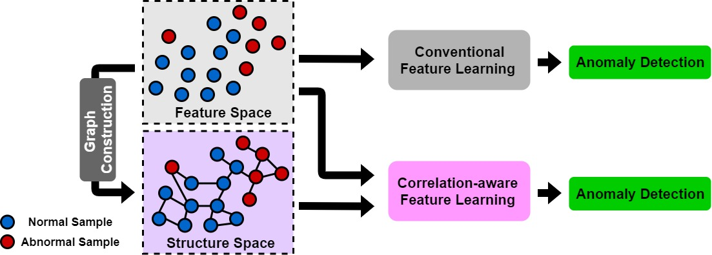
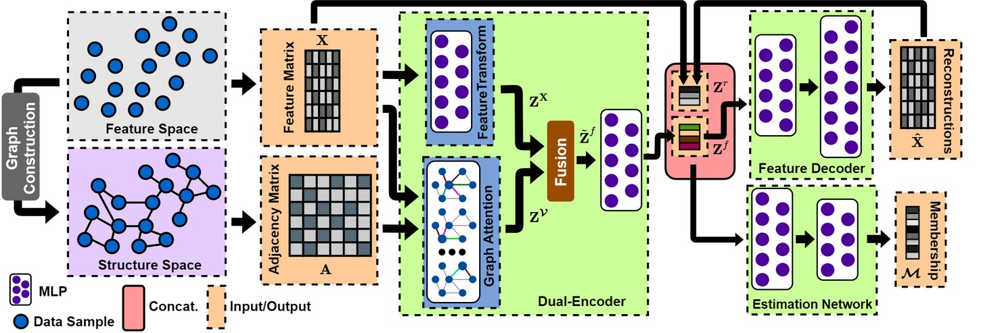
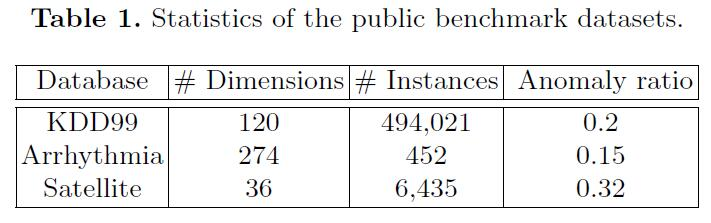
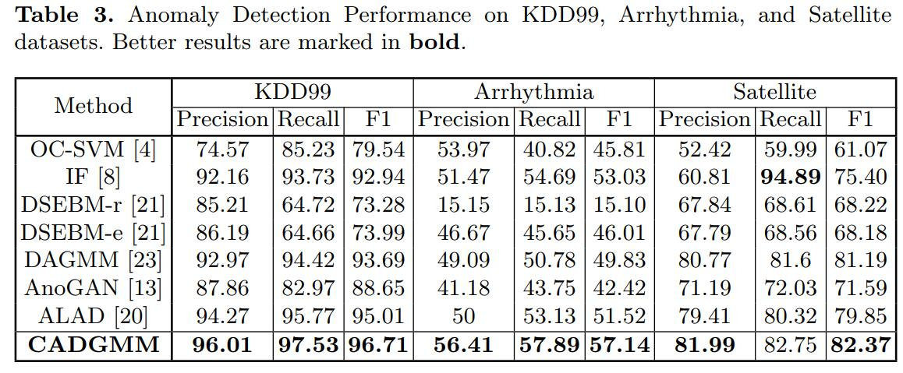

·

# CADGMM

Implementation code of the algorithm described in paper "CADGMM: Correlation-aware Deep Generative Model for Unsupervised Anomaly Detection". 


<p align="center">
  
</p>


## Abstract 

Unsupervised anomaly detection aims to identify anomalous samples from highly complex and unstructured data, which is pervasive in both fundamental machine learning research and industrial applications. However, most existing methods neglect the complex correlation among data samples, which is important for capturing normal patterns from which the abnormal ones deviate. In this paper, we propose a novel method of \textbf{C}orrelation aware unsupervised \textbf{A}nomaly detection via \textbf{D}eep \textbf{G}aussian \textbf{M}ixture \textbf{M}odel (\textbf{CADGMM}), which captures the complex correlation among data points to generate high-quality low-dimensional representation of each input data point. Specifically, the relations among data samples are correlated firstly in forms of a graph structure, in which, the node denotes the sample and the edge denotes the correlation between two samples from the feature space. Then, a dual-encoder that consists of a graph encoder and a feature encoder, is employed in CADGMM to encode both the feature and correlation information of samples into the low-dimensional latent space jointly, followed by a decoder for data reconstruction. Finally, a separate estimation network as a Gaussian Mixture Model is utilized to estimate the density of the learned latent vector, and the anomalies can be detected by measuring the energy of the samples with respect to a given threshold. Extensive experiments on real-world datasets demonstrate the effectiveness of the proposed method.

<p align="center">
  
</p>


## Experimental results  


<p align="center">
  
</p>

<p align="center">
  
</p>

## Cite:

```
@inproceedings{fan2020cadgmm,
  title        = {Correlation-aware Deep Generative Model for Unsupervised Anomaly Detection},
  author       = {Haoyi Fan, Fengbin Zhang, Ruidong Wang, Liang Xi, and Zuoyong Li},
  booktitle    = {The 24th Pacific-Asia Conference on Knowledge Discovery and Data Mining (PAKDD)},
  year         = {2020},
  organization={Springer}
}

```


